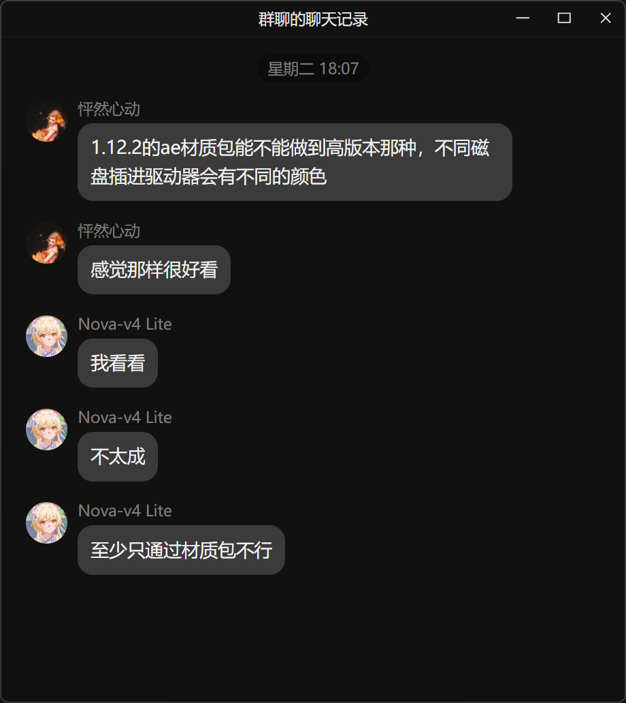
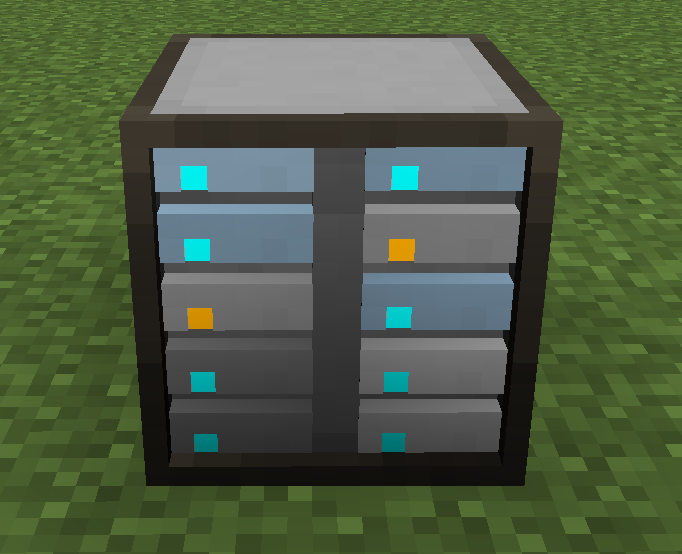
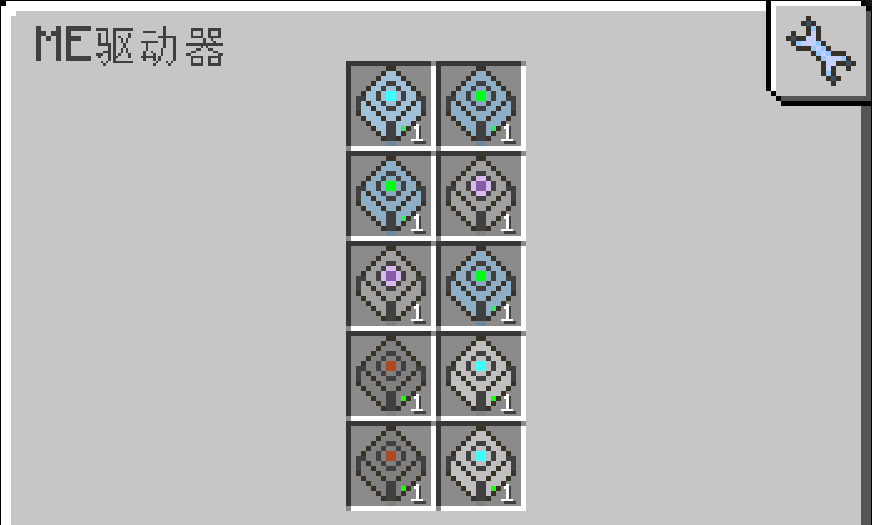
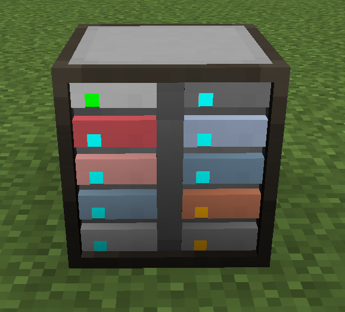
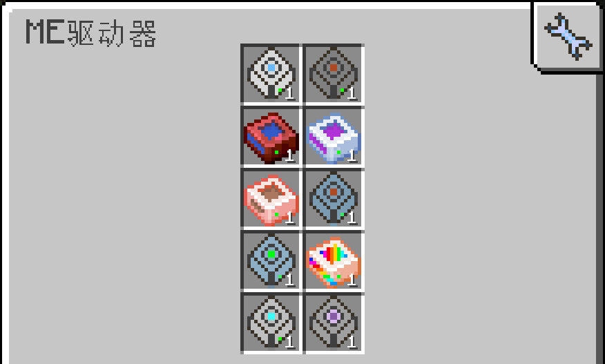

# AE2 Cell Render - 1.12.2

简体中文 | [English](https://github.com/zzhalex233/AE2-Cell-Render/blob/main/README-en_us.md)

---
## 模组
- 为 AE2 1.12.2 的`ME驱动器`提供更接近高版本的元件颜色渲染

## 功能

- 为ME驱动器已插入的槽位渲染对应存储元件的主要颜色
- 驱动器未连接ME网络时不渲染颜色
- 通过分析对应元件贴图来计算主色，支持mod元件&应用的资源包
- 同系列元件会统一主色
- 同系列内可按颜色拆分成家族，避免差异过大的元件被强制统一主色
- 支持通过配置文件调整系列/家族判定和最终显示颜色效果

## 安装与依赖

- 需要客户端和服务端同时安装

- 前置：[AE2UEL](https://github.com/AE2-UEL/Applied-Energistics-2)
- 前置：[MixinBooter](https://github.com/CleanroomMC/MixinBooter)

## 下载

- 在 Release 页面下载

## 灵感来源

---

## 画廊

