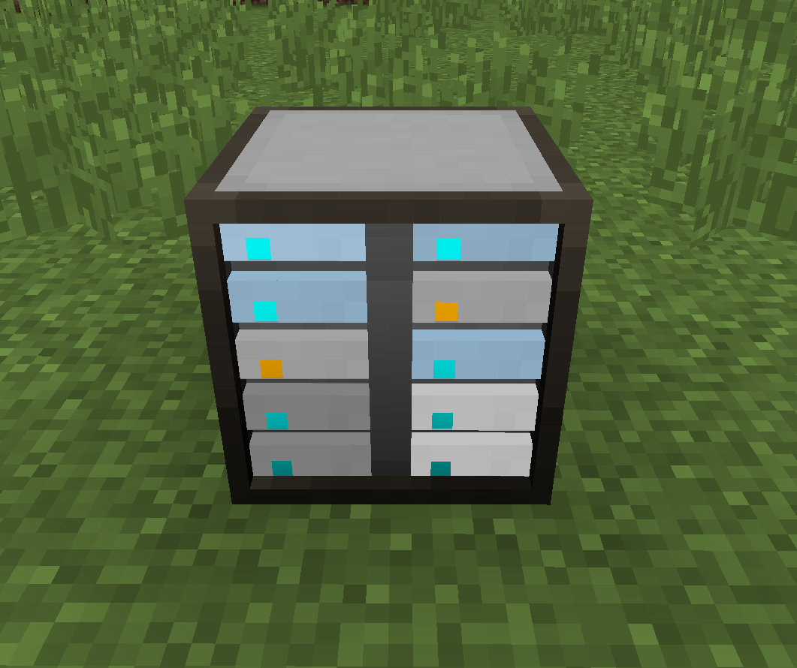
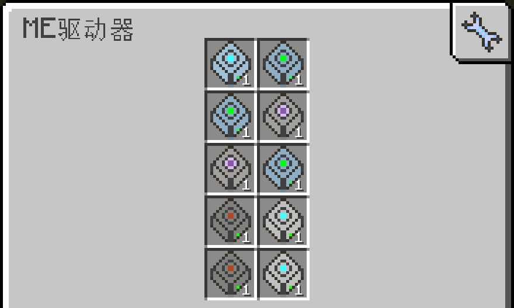

# AE2 Cell Render - 1.12.2

简体中文 | [English](https://github.com/zzhalex233/AE2-Cell-Render/blob/main/README-en_us.md)

---
## 模组
- 模仿高版本的`ME驱动器`的元件颜色渲染

## 功能

- 为ME驱动器已插入的槽位渲染对应存储元件的主要颜色
- 驱动器未连接ME网络时不渲染颜色
- 仅修改客户端渲染
- 通过分析对应元件贴图来计算主色，支持mod元件&资源包

## 依赖

- 前置：[AE2UEL](https://github.com/AE2-UEL/Applied-Energistics-2)

## 下载

- 在 Release 页面下载

## 灵感来源

---

## 画廊

